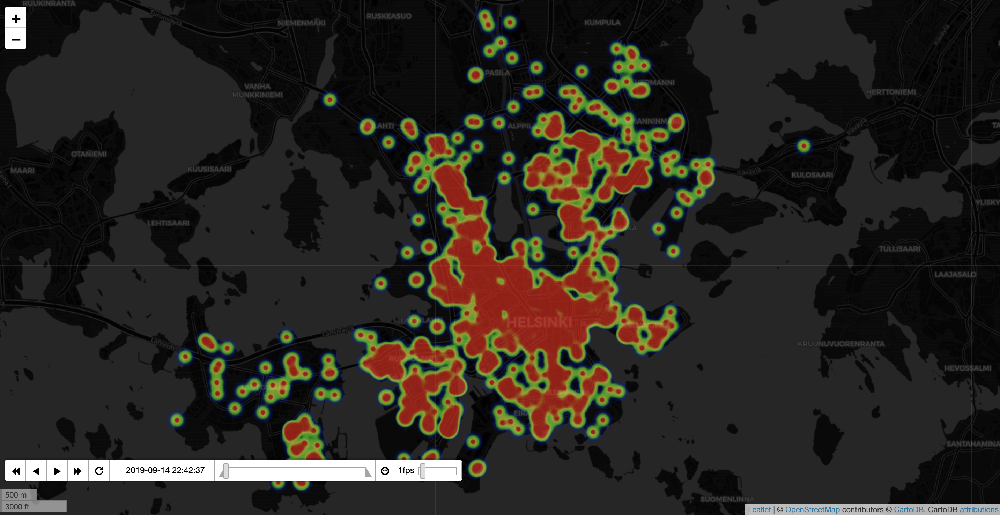
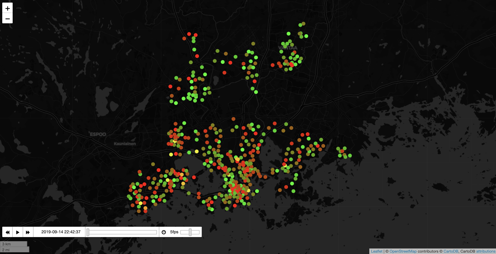
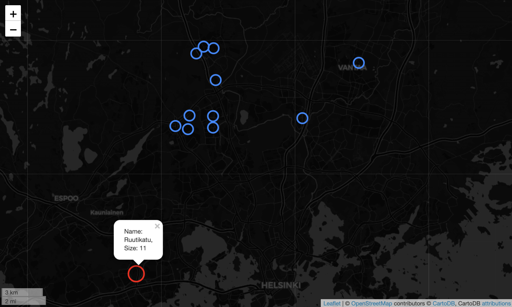

# Bike sharing in Helsinki
The purpose of the project is to analyze bike and scooter sharing systems in Helsinki (Autumn 2019).
The aim is to:

1. Predict bike availibility using among other features scooter density
2. Spot problematic bike stations which are clearly under- or overutilized

The latter is mostly discovered with interactive data visualization created with ’folium’. The original graphs use HeatMapWithTime plugin for plotting scooter density over time and TimestampedGeoJson plugin for plotting bike stations over time.

For predicting bikes' availibility the following features are used: days of week, hours of the day, scooter density, the mean for particular hour at particular day of the week (e.g. mean at Mondays 9), the 24h lag variable (same time previous day), air temperature, amount of clouds. Random Forest regression with a grid search cross validation method was implemented.

In 'Data collection' you can find the script which was used to query CityBikes and Voi APIs every five minutes for the period from 14 Sep to 1 Oct, 2019. Each response was timestamped and saved in full as an individual compressed JSON-file to minimize opportunities for data loss, as there would only be one chance to collect this data. The setting parameters of latitude and longitude are filtered to Helsinki location. This process resulted in a 74MB compressed JSON-file, which is too heavy to be loaded here.
